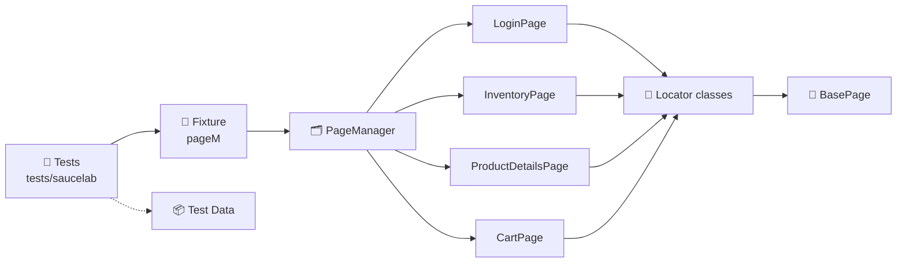

<div align="center">

# 🧪 SauceDemo Playwright POM Framework

**End-to-end UI test automation for [SauceDemo](https://www.saucedemo.com), built with Playwright + TypeScript using the Page Object Model.**

[](https://github.com/pranita2115/saucedemo-playwright-pom/actions/workflows/playwright.yml)


[Features](#-features) •
[Architecture](#-architecture) •
[Project Structure](#-project-structure) •
[Getting Started](#-getting-started) •
[Test Coverage](#-test-coverage) •
[CI/CD](#-cicd)

</div>

---

## ✨ Features

- 🧱 **Page Object Model** with a clear split between **locator classes** and **action classes**
- 🗂️ **PageManager** that gives tests a single entry point to every page object
- 🧩 **Custom Playwright fixture** (`pageM`) — no manual page-object setup in tests
- 📦 **Centralized test data** for users, products, prices, titles and error messages
- 📸 **Screenshots & traces** captured automatically on failure
- ⚡ **Fully parallel** execution
- 📊 **HTML report** generated after every run
- 🔁 **GitHub Actions CI** on every push and pull request

---

## 🏗️ Architecture



Each page is built in two layers:

| Layer | Responsibility | Example |
|---|---|---|
| **BasePage** | Shared `page` instance and navigation | `navigate(url)` |
| **Locator class** | Element locators only (getters) | `usernameField`, `loginButton` |
| **Page class** | User actions built on the locators | `login(username, password)` |

---

## 📁 Project Structure

```
saucedemo-playwright-pom/
├── .github/workflows/
│   └── playwright.yml            # CI pipeline
├── fixtures/
│   └── baseFixtures.ts           # Custom fixture exposing PageManager as `pageM`
├── pages/
│   ├── common/
│   │   ├── BasePage.ts           # Base class with shared helpers
│   │   └── PageManager.ts        # Single access point to all page objects
│   └── saucelab/
│       ├── login/                # LoginPage + LoginPageLocator
│       ├── inventory/            # InventoryPage + InventoryPageLocator
│       ├── productDetails/       # ProductDetailsPage + ProductDetailsPageLocator
│       └── cart/                 # CartPage + CartPageLocator
├── test-data/
│   └── saucelabData.ts           # Users, products, titles, error messages
├── tests/saucelab/
│   ├── login.spec.ts             # Login scenarios
│   └── addToCart.spec.ts         # Cart scenarios
└── playwright.config.ts
```

---

## 🚀 Getting Started

### Prerequisites

- [Node.js](https://nodejs.org/) (LTS recommended)
- npm

### Installation

```bash
# Clone the repository
git clone https://github.com/pranita2115/saucedemo-playwright-pom.git
cd saucedemo-playwright-pom

# Install dependencies
npm install

# Install Playwright browsers
npx playwright install
```

### Running Tests

| Command | Description |
|---|---|
| `npx playwright test` | Run the full suite |
| `npx playwright test tests/saucelab/login.spec.ts` | Run login tests only |
| `npx playwright test tests/saucelab/addToCart.spec.ts` | Run cart tests only |
| `npx playwright test --ui` | Open Playwright UI mode |
| `npx playwright test --debug` | Run step by step in debug mode |
| `npx playwright show-report` | Open the latest HTML report |

---

## ✅ Test Coverage

### 🔐 Login — `login.spec.ts`

| ID | Scenario |
|---|---|
| TC01 | Valid user can log in and lands on the inventory page |
| TC02 | Invalid credentials show the correct error message |
| TC03 | Locked-out user sees the locked-out error |

### 🛒 Add to Cart — `addToCart.spec.ts`

| ID | Scenario |
|---|---|
| TC01 | Add a single product and verify name, price and quantity in the cart |
| TC02 | Add multiple products and verify names and prices |
| TC03 | Add a product from the product details page |
| TC04 | Remove a product from the inventory page |
| TC05 | Remove one product from the cart page |
| TC06 | Cart keeps products after *Continue Shopping* |
| TC07 | Add all products to the cart |

---

## 🧑‍💻 Writing a Test

Tests use the `pageM` fixture, so every page object is ready to use:

```ts
import { test, expect } from '../../fixtures/baseFixtures'
import { saucelabData } from '../../test-data/saucelabData'

test("Valid user can login", async ({ pageM }) =>
{
    const user = saucelabData.users.standard

    await pageM.loginPage.navigate("/")
    await pageM.loginPage.login(user.username, user.password)

    await expect(pageM.page).toHaveURL(/inventory.html/)
})
```

---

## ⚙️ Configuration

Key settings in `playwright.config.ts`:

| Setting | Value |
|---|---|
| Base URL | `https://www.saucedemo.com` |
| Browser | Chromium (Desktop Chrome) |
| Parallel | `fullyParallel: true` |
| Screenshots | Only on failure |
| Trace | Retained on failure |
| Reporter | HTML |

---

## 🔁 CI/CD

The [GitHub Actions workflow](.github/workflows/playwright.yml) runs on every **push** and **pull request** to `main`/`master`:

1. Checks out the code and sets up Node.js (LTS)
2. Installs dependencies with `npm ci`
3. Installs Playwright browsers
4. Runs the full test suite
5. Uploads the **HTML report** as a build artifact (kept for 30 days)

---

## 🛠️ Tech Stack

| Tool | Purpose |
|---|---|
| [Playwright](https://playwright.dev/) | Browser automation & test runner |
| [TypeScript](https://www.typescriptlang.org/) | Typed test code |
| [GitHub Actions](https://github.com/features/actions) | Continuous integration |

---

## 👩‍💻 Author

**Pranita** — [@pranita2115](https://github.com/pranita2115)

<div align="center">

⭐ If you find this project useful, consider giving it a star!

</div>
